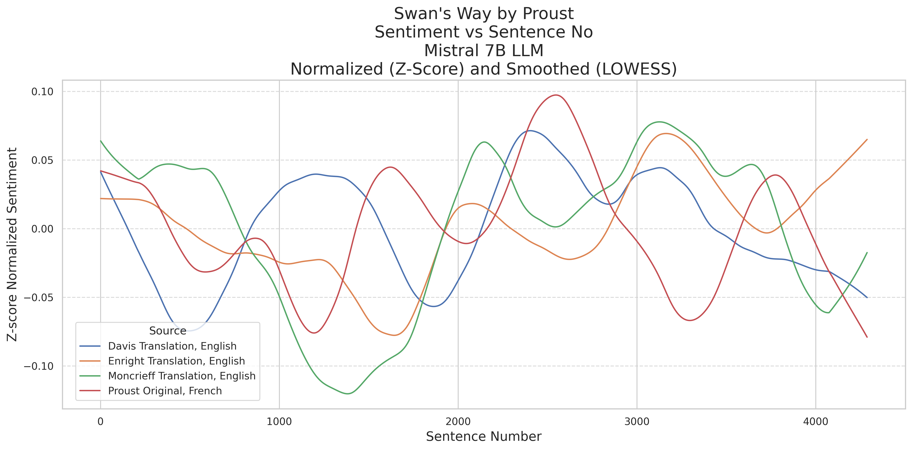
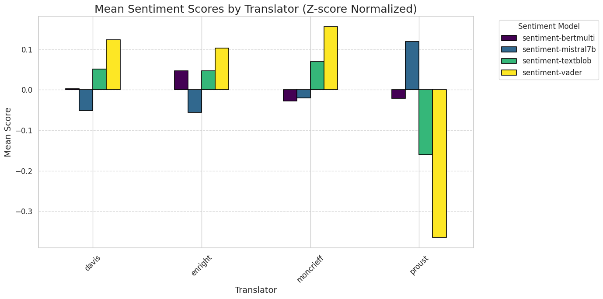

# AI-LIT:

# What is a Translator? Literary Translation in the Age of Large Language Models
    

### **KEYWORDS** Large Language Models (LLMs)1, Translation2, Artificial Intelligence3, GPT4o4, Sentiment Analysis5, Stylometry6, Mistral7, GenAI8

## **ABSTRACT** 

There are a number of metrics that quantify the fidelity of machine translation, but these metrics fail to capture the unique challenges of literary translation. Literary translation is subject to a different set of requirements that include a creative role for the translator. The latest Large Language Models (LLMs) like GPT4o and Mistral allow for new approaches that take into account more than just fidelity on a small scale. Dynamic word embeddings allow for a better assessment of context as well as more performant methods for comparing features across languages. We take as a case study the first volume of Marcel Proust’s A la recherche du temps perdu because the question of which translation is best is highly contested, and different translators make distinct choices aligned with different translation theories. Generative AI opens up new avenues for assessing what may or may not have been lost in these translations. We find that Artificial Intelligence (AI) uncovers aspects of translation that have been undertheorized in translation studies until now. These include changes in authorial style and the language of sentiment over time.

### NOTE:
This repo is in the process of being cleaned-up and reorganized. Please be patient...

